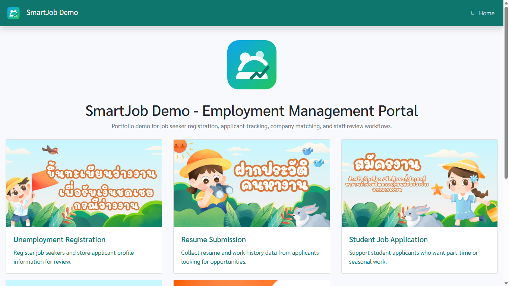

# CI4 SmartJob

CI4 SmartJob is a job seeker and employment management system built with CodeIgniter 4. It helps staff register applicants, manage job seeker profiles, track employment history, manage company records, process queues, and export resume-style PDF documents.

This repository is prepared for HR or technical reviewers as the primary review package. A Railway live demo can be added later, but the project can be evaluated from the source code, setup guide, screenshots, and workflow below.

## Main Features

- Staff login with demo administrator and staff accounts
- Job seeker registration for unemployed users, resume submission, and student applicants
- Applicant profile management with address, education, job history, and status data
- Company management and applicant selection workflow
- Dashboard summary for applicant counts, request status, and monthly activity
- Queue processing for applicant review and status updates
- Resume/PDF export using TCPDF
- Optional SMTP email notification configuration

## Technology Stack

| Area | Technology |
| --- | --- |
| Backend | PHP 8.1+, CodeIgniter 4 |
| Database | MySQL or MariaDB |
| PDF | TCPDF |
| Realtime/Socket dependency | Ratchet |
| Frontend | HTML, CSS, JavaScript, Bootstrap-style admin UI |
| Deployment target | Railway with Nixpacks |

## Screenshots

Two public screenshots are included. Add the remaining logged-in screenshots after running the database migrations and seeders locally.





## Local Installation

### Requirements

- PHP 8.1 or newer
- Composer
- MySQL 5.7+ or MariaDB
- PHP extensions: `intl`, `mbstring`, `mysqli`, `openssl`

### Setup Steps

```bash
git clone https://github.com/YOUR_USERNAME/ci4smartjob.git
cd ci4smartjob

composer install
cp .env.example .env
```

Create a database:

```bash
mysql -u root -p -e "CREATE DATABASE ci4smartjob CHARACTER SET utf8mb4 COLLATE utf8mb4_unicode_ci;"
```

Update `.env` if your local database username or password is different:

```ini
CI_ENVIRONMENT = development
app.baseURL = 'http://localhost:8080/'

database.default.hostname = localhost
database.default.database = ci4smartjob
database.default.username = root
database.default.password =
database.default.DBDriver = MySQLi
database.default.port = 3306
```

Run migrations and demo seed data:

```bash
php spark migrate --all
php spark db:seed DatabaseSeeder
php spark serve
```

Open the app:

```text
http://localhost:8080
```

## Demo Login

These accounts are for demo/testing only. Change them before production use.

| Role | Username | Password |
| --- | --- | --- |
| Administrator | `admin` | `admin123` |
| Staff | `staff` | `staff123` |

## Reviewer Workflow

1. Open the public home/registration area from `/`.
2. Register or review applicant data for unemployed users, resume submissions, or student applicants.
3. Log in as `admin` to access the staff dashboard.
4. Review dashboard summaries and applicant queues.
5. Open applicant details to inspect profile, education, address, and job history data.
6. Add or review company records.
7. Select applicants for company matching.
8. Export resume/PDF documents where applicant data is available.

## Railway Deployment Notes

Railway deployment is optional for review. If deploying:

1. Create a Railway project from this GitHub repository.
2. Add a MySQL service before running migrations.
3. Set app variables on the web service:

```text
CI_ENVIRONMENT=production
app.baseURL=https://your-app-name.railway.app/
```

4. Confirm the MySQL variables exist on the web service:

```text
MYSQLHOST
MYSQLUSER
MYSQLPASSWORD
MYSQLDATABASE
MYSQLPORT
```

5. Redeploy and confirm the release command runs:

```bash
php spark migrate --all && php spark db:seed DatabaseSeeder
```

## Security Before Sharing

- Do not commit `.env`.
- Do not commit real email passwords, API keys, tokens, or database credentials.
- Treat `admin/admin123` and `staff/staff123` as demo credentials only.
- Uploaded files in `public/uploads/` are ignored, except `default-profile.png` which is used as the fallback profile image.
- Use Railway Variables or local `.env` for secrets.

## HR Submission Message

A ready-to-send message is available in `docs/HR_SUBMISSION_MESSAGE.md`.
